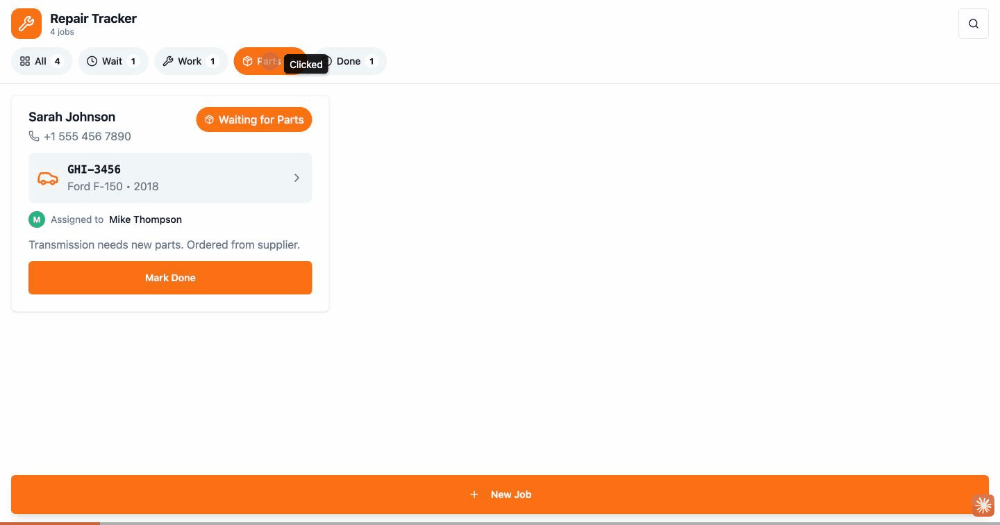

# repair-tracker-app

A small full-stack app for a car-repair garage to track repair jobs: register a
car and its problem, assign a mechanic, then move the job through its workflow and
filter by status. Built as a Bun monorepo with a React front end and a REST API
that share one set of TypeScript domain types.



*Filtering jobs by status (here, "Parts"), switching back to "All", then opening the New Job form and entering a problem description.*

## Features

- Create a repair job with license plate, customer, car (model / year), problem
  description, optional mechanic and photos.
- See all jobs as cards and filter them by status.
- Advance a job's status as the repair progresses.
- Delete a job.
- Front end and API share the same TypeScript types, so the data shape stays in
  sync across the stack.

## Tech stack

| Layer | Stack |
| ----- | ----- |
| Web (`apps/web`) | React, Vite, TypeScript, Tailwind CSS, shadcn/ui (Radix UI), lucide-react |
| API (`apps/api`) | Bun's native HTTP server (`Bun.serve`), a small REST API in TypeScript |
| Shared (`packages/shared`) | TypeScript domain types and helpers used by both apps |
| Tooling | [Bun](https://bun.com) workspaces (one install for the whole repo) |

## Monorepo structure

```
apps/
  api/        # Bun HTTP server — REST endpoints for jobs (in-memory store)
    src/
      index.ts  # routes + request handling
      cors.ts   # shared CORS headers
  web/        # React + Vite front end
    src/
      api/        # fetch helpers that call the API
      components/  # job cards, status badges/filters, the New Job form, UI primitives
packages/
  shared/     # Job / Customer / Car / Mechanic / Device / License types + helpers
```

## Domain model

The shared types live in [`packages/shared`](./packages/shared) and are imported by
both apps. The core entity is a **Job**, which moves through four statuses:

| Status | Label |
| ------ | ----- |
| `waiting` | Waiting |
| `in-progress` | In Progress |
| `waiting-for-parts` | Waiting for Parts |
| `done` | Done |

The shared layer also models the surrounding entities a shop needs — `Customer`,
`Car`, `Mechanic`, plus `Device` and `License` types for a future multi-device
setup. The current API stores a flattened job record in memory (see below); the
richer relational types describe where the model is headed.

## API

The API runs on `http://localhost:3001` and keeps jobs **in memory**, so data
resets when the server restarts.

| Method | Path | Purpose |
| ------ | ---- | ------- |
| `GET` | `/jobs` | list all jobs |
| `POST` | `/jobs` | create a job — requires `licensePlate` and `deviceId` |
| `PATCH` | `/jobs/:id` | update a job's `status` |
| `DELETE` | `/jobs/:id` | delete a job |

**Create a job**

```http
POST /jobs
Content-Type: application/json

{
  "licensePlate": "ABC-1234",
  "deviceId": "front-desk",
  "customerName": "Maria Garcia",
  "customerPhone": "+1 555 123 4567",
  "carModel": "Honda Civic",
  "carYear": "2019",
  "problemDescription": "Engine making a strange noise when accelerating.",
  "status": "waiting",
  "photos": []
}
```

The server fills in `id`, `createdAt` and `updatedAt` and returns the created job
with `201`. Missing `licensePlate` or `deviceId` returns `400`; an unknown id on
`PATCH` / `DELETE` returns `404`.

**Update status**

```http
PATCH /jobs/<id>
Content-Type: application/json

{ "status": "in-progress" }
```

## Getting started

Requires [Bun](https://bun.com) (the repo was created with Bun 1.3).

```bash
bun install            # install every workspace at once

# terminal 1 — API on http://localhost:3001
bun run --cwd apps/api dev

# terminal 2 — web app on http://localhost:5173
bun run --cwd apps/web dev
```

Open the web app and the job list loads from the API. The front end calls the API
base URL defined in [`apps/web/src/api/jobs.tsx`](./apps/web/src/api/jobs.tsx).

## Notes & limitations

- **In-memory storage.** Jobs live in a plain array in the API process; restarting
  the server clears them. A database would be the natural next step.
- **CORS.** The API returns permissive CORS headers (`apps/api/src/cors.ts`) so the
  Vite dev server can call it during local development.
- **Shared types first.** The `@garage/shared` package is the single source of truth
  for the data shape; both apps import from it instead of redeclaring types.

## Possible next steps

- Persist jobs in a database instead of memory.
- Wire up the `Customer` / `Car` / `Mechanic` relations the shared types already
  describe.
- Add authentication and the multi-device licensing the `Device` / `License` types
  sketch out.
- Tests for the API routes and the New Job form.

## License

This project is licensed under the MIT License — see the [LICENSE](LICENSE) file.
